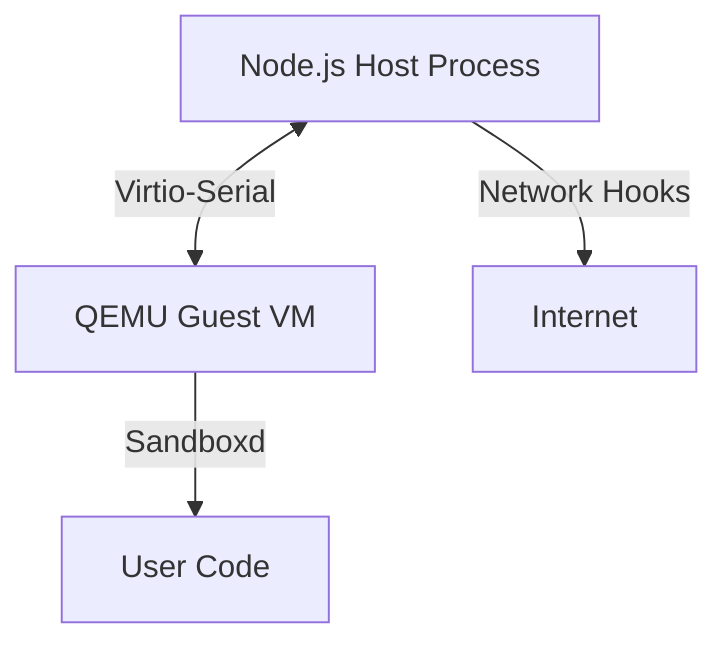

# System Architecture

Gondolin creates a secure, programmable environment by running a minimal Linux Guest inside a QEMU micro-VM, controlled by a Node.js Host process.

## High-Level Overview

## Components

### 1. The Guest (`guest/`)
The Guest is a minimal Alpine Linux system.
*   **`sandboxd`:** A Zig daemon that acts as the init process (PID 1). It listens on a virtio-serial port for commands from the Host.
*   **Initramfs:** Contains only the absolute essentials (BusyBox, libc, generic certificates) to boot quickly.

### 2. The Host (`host/`)
The Host is a TypeScript application that manages the QEMU process.
*   **Controller:** Sends `exec` commands to `sandboxd` and streams stdin/stdout/stderr.
*   **Network Stack:** A pure-JavaScript implementation of Ethernet/IP/TCP. It intercepts traffic from the Guest's tap device, allowing the Host to rewrite requests, inject secrets, or block connections *before* they leave the machine.
*   **VFS (Virtual Filesystem):** The Guest mounts a FUSE filesystem (`sandboxfs`) which proxies file operations back to the Host via virtio-serial. This allows mounting in-memory files or host directories.

## Security Model

*   **Secret Injection:** Secrets (like API keys) are never stored in the Guest's filesystem or environment variables. They are injected by the Host's network stack only when an outbound HTTP request matches an allowed domain.
*   **Isolation:** The Guest has no direct network access. All traffic is mediated by the Host.
